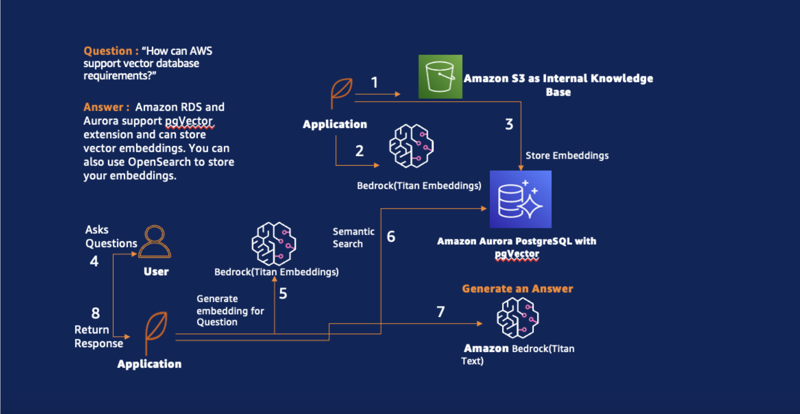
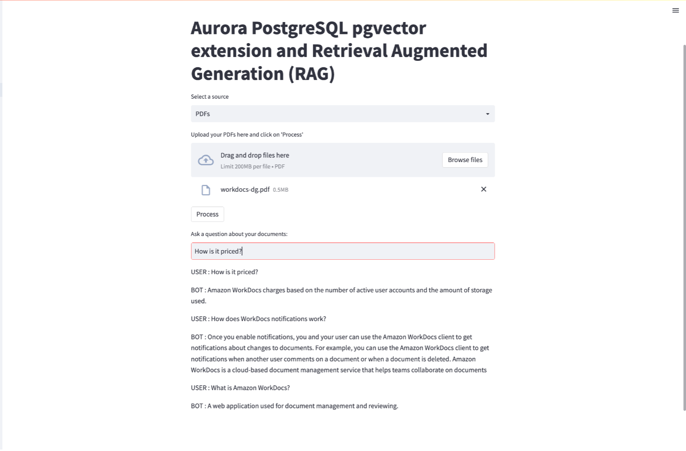
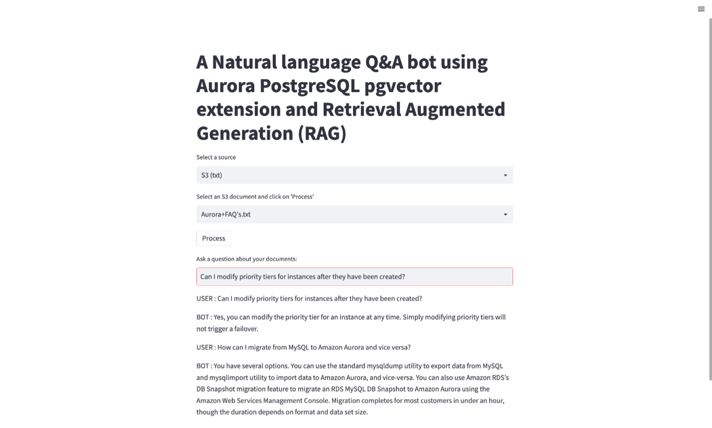
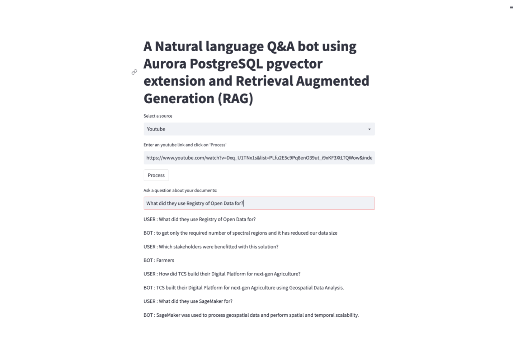
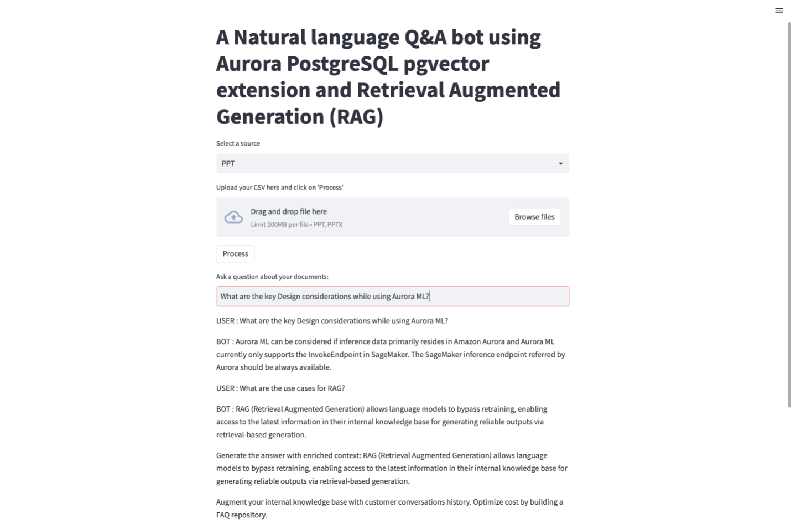

## Build a semantic search application leveraging pgvector for Aurora PostgreSQL and Amazon Bedrock

### Use Case

In the evolving landscape of generative AI, the quest to create more sophisticated and contextually
aware Q&A bots has intensified. Customers are eager to leverage LLMs to improve their own Q&A bots
but they often face challenges due to limitations of using off-the-shelf LLMs as they are trained on
general domain corpora, making them less effective on domain-specific tasks. For more complex and
knowledge-intensive tasks, it's possible to build a language model-based system that accesses external
knowledge sources to complete tasks. This enables more factual consistency, improves reliability of the
generated responses, and helps to mitigate the problem of "hallucination".

Retrieval Augmented Generation (RAG) is a method introduced to address knowledge intensive tasks.
RAG combines an information retrieval component with a text generator model. RAG can be fine-tuned
and its internal knowledge can be modified in an efficient manner and without needing retraining of the
entire model.

The code provides insights on how to leverage pgvector extension in Amazon Aurora PostgreSQL and use
RAG methodology with Titan large language models (LLMs) supported by Amazon Bedrock to enable
customers to build sophisticated and contextually aware Q&A bots. It demonstrate how RAG can
retrieve data for multiple content types from multiple data sources using LangChain connectors and
augments the prompts by adding the relevant retrieved data in context. It also shows how
conversation history can be stored in a durable store to build a corpus of FAQ's to augment your internal
knowledge base and achieve cost optimization by reducing additional calls to LLMs. Notably, the
versatility of this Q&A bot extends to diverse internal document sources, including PDFs, videos, text
files, and PowerPoint presentations, enhancing its utility and applicability across a spectrum of
information mediums.

### Architecture

The architecture behind Retrieval Augmented Generation (RAG) is designed to seamlessly integrate external data sources and efficiently generate contextually relevant responses. In the RAG framework, the incorporation of external data from diverse sources such as documents, repositories, databases, or APIs plays a pivotal role. The architecture ensures the compatibility of data formats for accurate relevancy search and augmentation of user prompts.



1. Companies possess a repository of knowledge resources, ranging in formats like PDFs,
text documents, videos, and more.

2. Utilizing the Titan Embedding model from Amazon Bedrock, these resources are
transformed into vector representations, ensuring their compatibility for advanced
processing.

3. The generated vector embeddings are then stored within Amazon Aurora PostgreSQL,
utilizing the specialized pgVector capabilities for efficient storage and retrieval.
4. A user initiates the process by posing a question, for instance, "How can AWS support
vector databases?"

5. The user's question is seamlessly translated into its vector embedding, facilitating
subsequent computational comparisons.

6. A semantic search operation is executed on the Amazon Aurora PostgreSQL database,
employing the vectorized representations to identify knowledge resources with relevant
information.

7. The extracted answers from the search are fed into the Amazon Titan Large model.

8. Leveraging the enhanced context and knowledge derived from the semantic search, the
Amazon Titan Large model generates a comprehensive response.

9. The generated response is subsequently delivered back to the user, providing them with a
meaningful and informed answer to their initial question.

10. To retain context and support future interactions, the chat history is stored in Amazon
DynamoDB, ensuring a seamless continuation of the conversation with the user.

### Execution

1. Make sure your Amazon Aurora PostgreSQL Database is setup with pgvector extension.

2. Make sure you have access to the Amazon Bedrock models you are trying to use

3. The EC2 where you are runing the code needs access to the Amazon Aurora PostgreSQL Database, Amazon Bedrock Aws Secrets Manager via IAM Role

4. The code runs on Python3.10. Activate a virtual environment and install all the requirements
```
python3.10 -m venv venv
source venv/bin/activate
pip3 install -r requirements.txt
```

5. Modify the code variables Home.py with the appropriate details according to your environment: 
secret_name -> Secrete manager where for storing your Amazon Aurora PostgreSQL details
database -> the database name where embeddings will be created
model_id -> The Bedrock Model which you will be using

6. To run the Streamlit application
```
streamlit run Home.py
```

### Output

Sample output for the application

1. Using PDFs as source


2. Using Amazon S3 as source


3. Using Youtube as source


4. Using PPT as Source


### Security

See [CONTRIBUTING](CONTRIBUTING.md#security-issue-notifications) for more information.

### License

This library is licensed under the MIT-0 License. See the LICENSE file.

